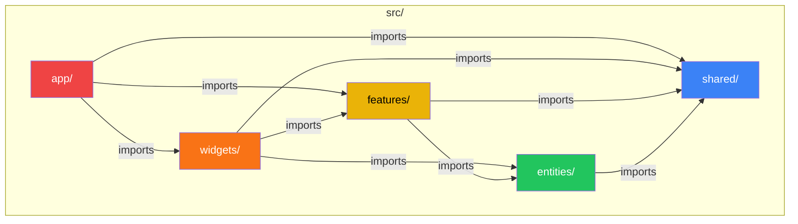
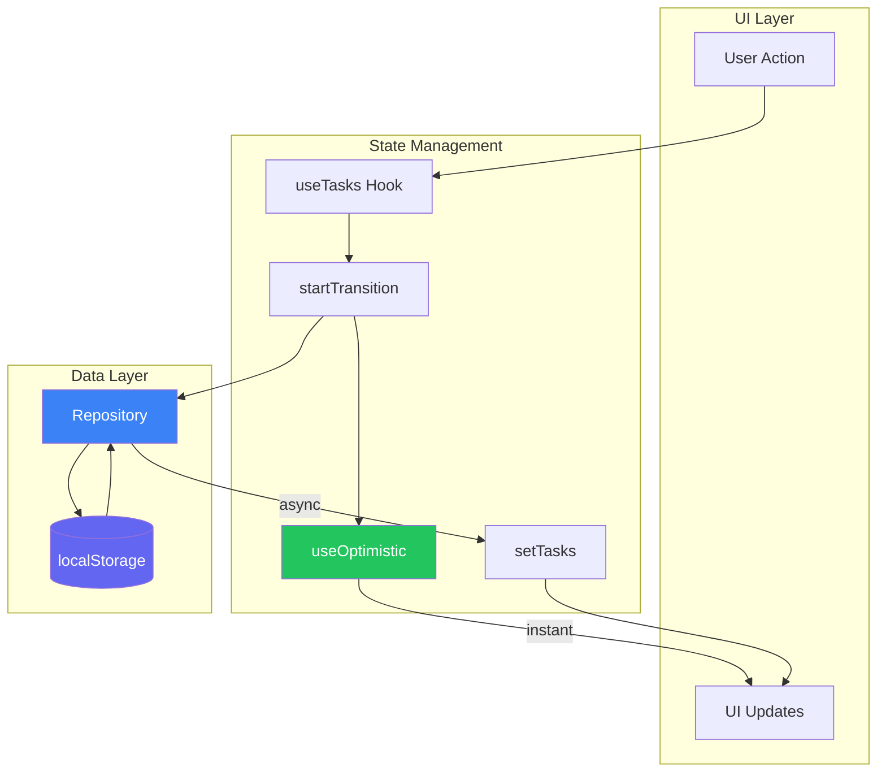

# Todo App

Task management application built with Next.js 15 and React 19.

## What It Does

- Create, edit, delete tasks with optional deadlines
- Mark tasks complete/incomplete with instant UI feedback
- Drag and drop to reorder tasks within columns
- Search by title or description
- Filter by status (all/pending/completed)
- Dark/light mode toggle
- Data persists in localStorage

## Tech Stack

| Tech | Why |
|------|-----|
| **Next.js 15** | App Router, Turbopack for fast dev |
| **React 19** | `useOptimistic` for instant feedback, `startTransition` for smooth updates |
| **TypeScript** | Type safety, better DX |
| **Tailwind CSS** | Rapid styling with utilities |
| **shadcn/ui** | Accessible components on Radix UI |
| **@dnd-kit** | Modern drag-and-drop, accessible |
| **Framer Motion** | Smooth task animations |
| **date-fns** | Lightweight date formatting |
| **Biome** | Fast linting + formatting (replaces ESLint + Prettier) |
| **fast-check** | Property-based testing |
| **Husky** | Git hooks for quality gates |
| **commitlint** | Enforce conventional commits |

## Architecture: Feature-Sliced Design

Code organized by business domain, not technical type.



| Layer | Purpose | Example |
|-------|---------|---------|
| **app** | Entry point, providers | `layout.tsx`, `page.tsx` |
| **widgets** | Composite UI blocks | `TaskBoard` |
| **features** | User interactions | `create-task`, `delete-task` |
| **entities** | Business domain | `task` (model + UI) |
| **shared** | Reusable foundation | `ui`, `hooks`, `api`, `lib` |

**Import rule:** Arrows flow down only. A layer can only import from layers below it.

## Data Flow



**Why this pattern?**
- `useOptimistic` gives instant feedback (green path)
- Repository abstracts storage - swap localStorage for API by writing a new adapter
- State syncs after persistence completes

## Commands

```bash
pnpm dev          # Dev server (port 3301)
pnpm build        # Production build
pnpm check        # Biome lint + format
pnpm test         # Run all tests
pnpm test:changed # Run tests for changed files only
pnpm typecheck    # TypeScript type checking
```

## Key Decisions

### Biome over ESLint + Prettier
Single tool, 2x faster. Trade-off: fewer rules, but the default set covers most cases. `globals.css` excluded because Tailwind's `@apply` isn't standard CSS.

### @dnd-kit over react-beautiful-dnd
Modular, accessible by default, actively maintained. react-beautiful-dnd is in maintenance mode.

### localStorage vs API
Zero infrastructure for a demo app. Repository pattern means adding a backend later is straightforward.

### Optimistic Updates
UI updates instantly before async operations complete. Users see immediate feedback instead of spinners.

```typescript
startTransition(() => {
  setOptimisticTask({ type: 'toggle', id }); // instant
});
await repository.toggle(id); // then persist
```

### Presentational Components + Custom Hooks
Business logic is extracted to hooks, components are 100% presentational:

```typescript
// page.tsx - pure render, no logic
export default function HomePage() {
  const { pendingTasks, taskActions, ... } = useTaskPageHandlers();
  return <TaskBoard actions={taskActions} ... />;
}
```

### Single-Pass Filtering (Performance)
Instead of multiple `.filter()` calls, tasks are filtered and partitioned in one loop:

```typescript
// O(n) instead of O(n × m)
for (const t of tasks) {
  if (matchesSearch(t) && matchesStatus(t)) {
    filtered.push(t);
    (t.completed ? completed : pending).push(t);
  }
}
```

## Git Hooks (Quality Gates)

Husky runs automated checks at different stages:

| Hook | When | What runs |
|------|------|-----------|
| `pre-commit` | Before commit | `typecheck` → `test:changed` → `lint-staged` |
| `commit-msg` | After writing message | `commitlint` validates format |
| `pre-push` | Before push | Full test suite |

### Commit Convention

Commits must follow [Conventional Commits](https://www.conventionalcommits.org/) with FSD-aware scopes:

```
<type>(<scope>): <description>

# Examples:
feat(features/create-task): add deadline picker
fix(shared/hooks): resolve state desync in reorder
test(shared/api): add property-based tests for repository
```

**Allowed scopes:** `app`, `widgets`, `features/*`, `entities/*`, `shared/*`, `tests`, `deps`, `ci`

## Bug Fixes Applied

| Bug | Issue | Fix |
|-----|-------|-----|
| Mutation in toggle | Task object mutated directly | Create new object with spread |
| Deadline order | `isToday()` checked before `isPast()` | Check `isPast()` first |
| Reorder data loss | Completed tasks discarded when reordering pending | Preserve tasks not in reorder list |
| State desync | `reorderTasks` didn't use repository result | Use returned task list to update state |
| Null safety* | `title` access could crash on undefined | Added optional chaining `t.title?.toLowerCase()` |

*Discovered via property-based testing with fast-check

## Custom Hooks

Hooks are organized by layer following FSD:

| Hook | Layer | Purpose |
|------|-------|---------|
| `useTaskPageHandlers` | app | Orchestrates page state, dialogs, handlers |
| `useTaskLookupMaps` | widgets | O(1) task lookup via Map/Set |
| `useDragActionDetector` | widgets | Determines drag action (toggle/reorder) |
| `useDragOverlay` | widgets | Drag state & event handlers |
| `useTasks` | shared | Core state + optimistic updates |
| `useDialogState<T>` | shared | Generic dialog open/close + data |
| `useTaskNotifications` | shared | Centralized toast messages |

### TaskActions Type

Consolidates handler props to reduce drilling:

```typescript
interface TaskActions {
  onToggle: (id: string) => void;
  onEdit: (task: Task) => void;
  onDelete: (task: Task) => void;
}

// Instead of 3 props, pass one object
<TaskBoard actions={taskActions} />
```

## Project Structure

```
src/
├── app/
│   ├── hooks/
│   │   └── useTaskPageHandlers.ts  # Page-level orchestration
│   ├── globals.css                 # Tailwind + CSS variables
│   ├── layout.tsx                  # Root layout + Toaster
│   ├── page.tsx                    # Main page (presentational)
│   └── providers.tsx               # Theme + Repository context
│
├── widgets/task-board/
│   ├── hooks/
│   │   ├── useTaskLookupMaps.ts    # O(1) Map/Set lookups
│   │   ├── useDragActionDetector.ts # Drag logic
│   │   └── useDragOverlay.ts       # Drag state & handlers
│   ├── task-board.tsx              # DnD board (presentational)
│   ├── droppable-column.tsx        # Column with drop highlighting
│   └── task-card-overlay.tsx       # Drag overlay
│
├── features/
│   ├── create-task/          # TaskForm with validation
│   ├── edit-task/            # EditTaskDialog
│   ├── delete-task/          # DeleteConfirm dialog
│   ├── toggle-task/          # TaskCheckbox
│   ├── filter-tasks/         # SearchBar + FilterDropdown
│   ├── reorder-tasks/        # SortableTaskList
│   └── toggle-theme/         # ThemeSwitch
│
├── entities/task/
│   ├── model/types.ts        # Task, TaskActions interfaces
│   └── ui/                   # TaskCard, SortableTaskCard
│
└── shared/
    ├── api/                  # task-repository.ts
    ├── hooks/                # useTasks, useDialogState, useTaskNotifications
    ├── lib/                  # utils, formatters, storage/
    └── ui/                   # shadcn components
```

## Testing

Two testing strategies: **unit tests** + **property-based tests** (fast-check).

```
__tests__/
├── shared/api/
│   ├── task-repository.test.ts           # Unit: CRUD operations
│   └── task-repository.property.test.ts  # Property: ID uniqueness, toggle involution
├── shared/lib/
│   ├── formatters.test.ts                # Unit: date formatting
│   ├── formatters.property.test.ts       # Property: format consistency
│   ├── utils.property.test.ts            # Property: cn() idempotence, associativity
│   └── filter-utils.property.test.ts     # Property: filter monotonicity, null safety
└── features/filter-tasks/filter.test.ts  # Unit: search + status filter
```

### Property-Based Testing

Instead of hand-picked examples, fast-check generates 1000+ random inputs to find edge cases:

```typescript
it('toggle is an involution (double toggle = original)', async () => {
  await fc.assert(
    fc.asyncProperty(fc.uuid(), async (id) => {
      await repository.toggle(id);
      await repository.toggle(id);
      // State should be back to original
    })
  );
});
```

**Properties tested:**
- `cn()`: idempotence, associativity, Tailwind conflict resolution
- `formatDeadline()`: null handling, past/future consistency
- `isOverdue()`: boolean return, temporal correctness
- Repository: ID uniqueness, toggle involution, reorder preserves tasks
- Filters: monotonicity (never increases), case-insensitivity

Run with `pnpm test`.

## Configuration Files

| File | Purpose |
|------|---------|
| `biome.json` | Linting + formatting rules |
| `commitlint.config.js` | Commit message validation |
| `.editorconfig` | Editor settings (UTF-8, LF, 2-space indent) |
| `tsconfig.json` | TypeScript strict mode + path aliases |
| `tailwind.config.ts` | Theme with CSS variables |

## Potential Improvements

- API backend with sync indicator
- Undo/redo with transaction history
- Task categories/tags
- Recurring tasks
- Subtasks (hierarchical structure)
- Export/import (CSV, calendar sync)
- Virtual scroll for large lists
