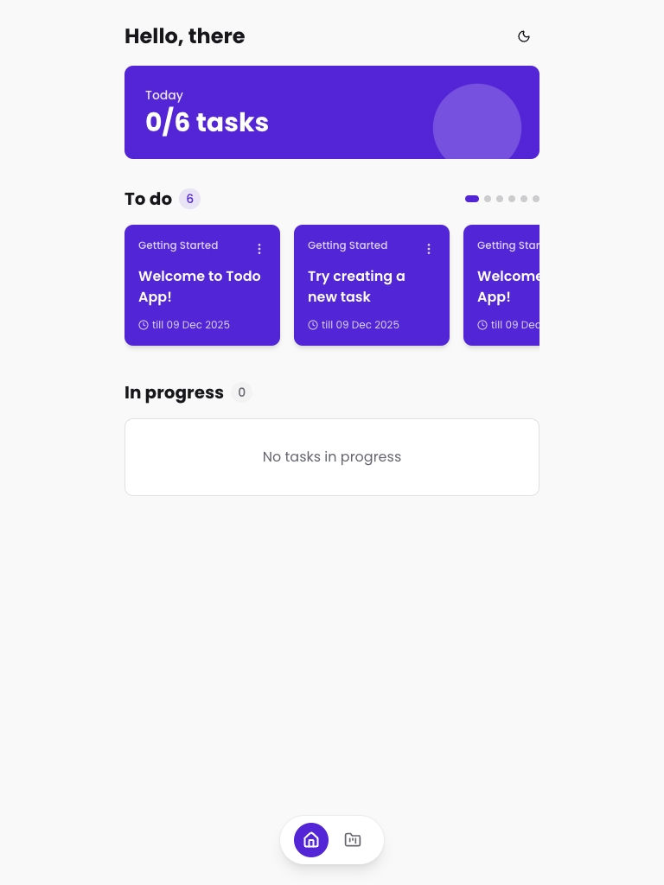
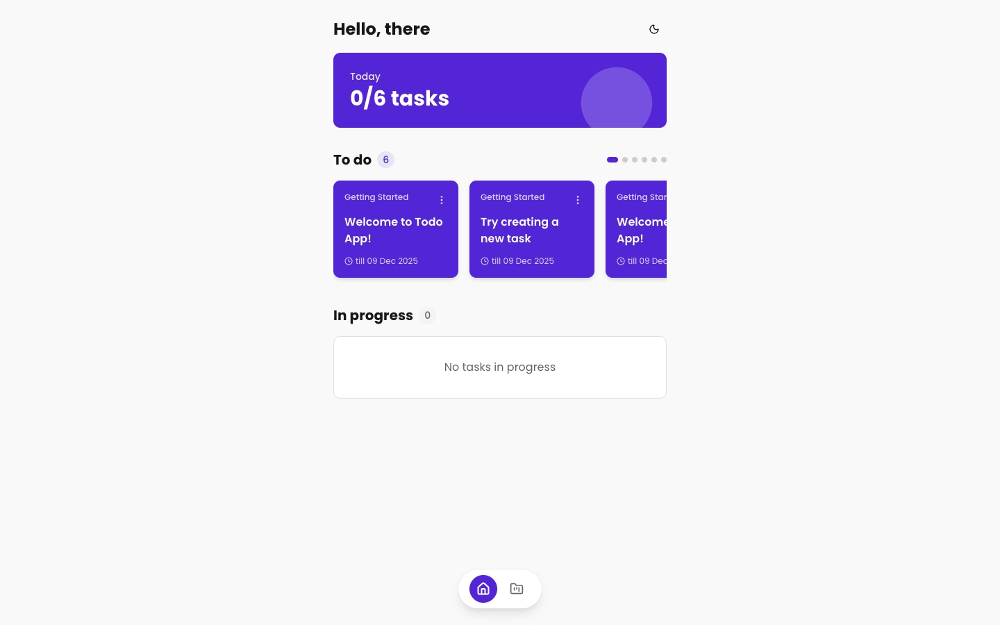
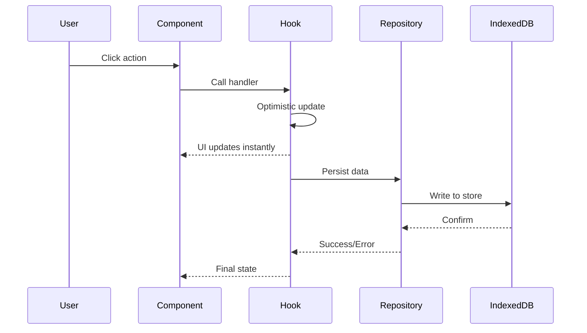

# Todo App

[](https://taberoa.com)
[](LICENSE)
[](https://nextjs.org)
[](https://typescriptlang.org)
[](https://tailwindcss.com)

Project and task management application built with Next.js 15 and React 19.

<p align="center">
  
  
  
</p>

## Quickstart

**Requirements:** Node.js 18+, pnpm

```bash
pnpm install
pnpm dev        # runs on http://localhost:3301
```

## Features

- **Projects**: Create, edit, delete projects with custom colors
- **Tasks**: Create, edit, delete tasks with deadlines
- **Status Management**: Swipe tasks to change status (Todo → In Progress → Done)
- **Views**: Home (today's tasks), Projects list, Project detail
- **Theme**: Dark/light mode with system preference support
- **Responsive**: Mobile-first design with floating navigation
- **Persistence**: Data stored in IndexedDB

## Tech Stack

| Tech | Why |
|------|-----|
| **React 19** | `useOptimistic` for instant UI feedback |
| **IndexedDB** | Async API, handles large datasets (vs localStorage) |
| **Biome** | Single tool for lint + format (vs ESLint + Prettier) |
| **fast-check** | Property-based testing for edge case coverage |
| **shadcn/ui** | Accessible components built on Radix UI |
| **next-themes** | SSR-safe theme management |

## Architecture: Feature-Sliced Design

Code organized by business domain, not technical type.

```
src/
├── app/                      # Entry points and routing
│   ├── page.tsx              # Home view
│   ├── projects/
│   │   ├── page.tsx          # Projects list
│   │   └── [id]/page.tsx     # Project detail
│   └── providers.tsx         # Context providers
│
├── widgets/                  # Composite UI blocks
│   └── bottom-nav/           # Floating navigation
│
├── features/                 # User interactions
│   ├── create-task/          # CreateTaskModal
│   ├── edit-task/            # EditTaskModal
│   ├── create-project/       # CreateProjectWizard
│   ├── edit-project/         # EditProjectModal
│   └── toggle-theme/         # ThemeSwitch
│
└── shared/                   # Reusable foundation
    ├── api/                  # Repositories + types
    ├── hooks/                # Custom hooks
    ├── lib/                  # Utilities (colors, formatters)
    ├── config/               # Constants
    └── ui/                   # shadcn components
```

**Import rule:** Layers can only import from layers below.

## Data Flow



- **Optimistic updates**: UI updates instantly before async operations complete
- **Repository pattern**: Storage abstracted behind interfaces, easy to swap backends

## Commands

```bash
pnpm dev          # Dev server (port 3301)
pnpm build        # Production build
pnpm check        # Biome lint + format
pnpm test         # Run all tests
pnpm knip         # Find dead code
pnpm typecheck    # TypeScript type checking
```

## Key Decisions

### IndexedDB over localStorage
Async API, better for large datasets, supports indexes for queries.

### Repository Pattern
Storage abstracted behind interfaces. Swap IndexedDB for an API backend by implementing a new adapter.

### Swipe Gestures for Status
Mobile-friendly way to change task status without opening modals.

### Color Utilities
Centralized in `colors.ts`: `getDarkModeColor`, `getContrastColor` for theme-aware colors.

## Testing

Unit tests + property-based tests using fast-check for edge case discovery.

```bash
pnpm test
```

## Credits

Design inspired by [Dmitry Lauretsky](https://dribbble.com/dlauretsky) from [Ronas IT](https://dribbble.com/ronasit) — [Task Management App](https://dribbble.com/shots/15963414-Task-Management-App)
